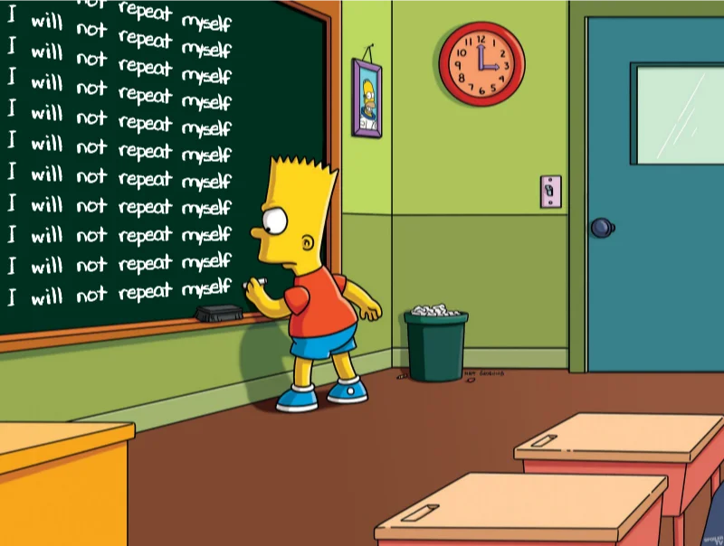

# DRY R Package Development

This presentation contains tips on how to develop R packages without
violating the DRY (Don't Repeat Yourself) Principle in

- documentation
- unit testing
- vignette setup
- data
- conditions

Link to slides:
<https://www.indrapatil.com/dry-r-package-development/>



## Development

This project uses R 4.6.0 or later (declared in `DESCRIPTION`), [Quarto](https://quarto.org/) for rendering slides, and [just](https://github.com/casey/just) as a command runner.

### Prerequisites

```bash
# Install just (macOS)
brew install just
```

### Setup

```bash
just install
```

### Just Commands

```bash
just help     # Show all available commands
just install  # Install R dependencies from DESCRIPTION
just render   # Render slides to HTML
just preview  # Start a live preview with auto-reload
just open     # Alias for preview (live-reload dev server over localhost)
just clean    # Remove generated files and caches
just check    # Check the Quarto and R version setup
just          # Install dependencies and start live-reload preview
```

## Feedback

Feedback and suggestions are welcome in [the issue tracker](https://github.com/IndrajeetPatil/dry-r-package-development/issues).
