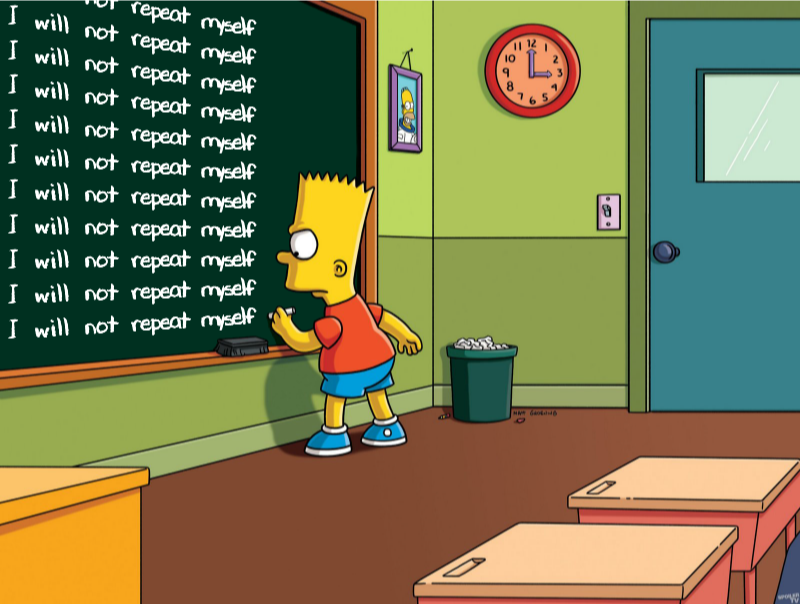

# DRY R Package Development

This presentation contains tips on how to develop R packages without
violating the DRY (Don't Repeat Yourself) Principle in

- documentation
- unit testing
- vignette setup
- data
- conditions

Link to slides:
<https://www.indrapatil.com/dry-r-package-development/>

